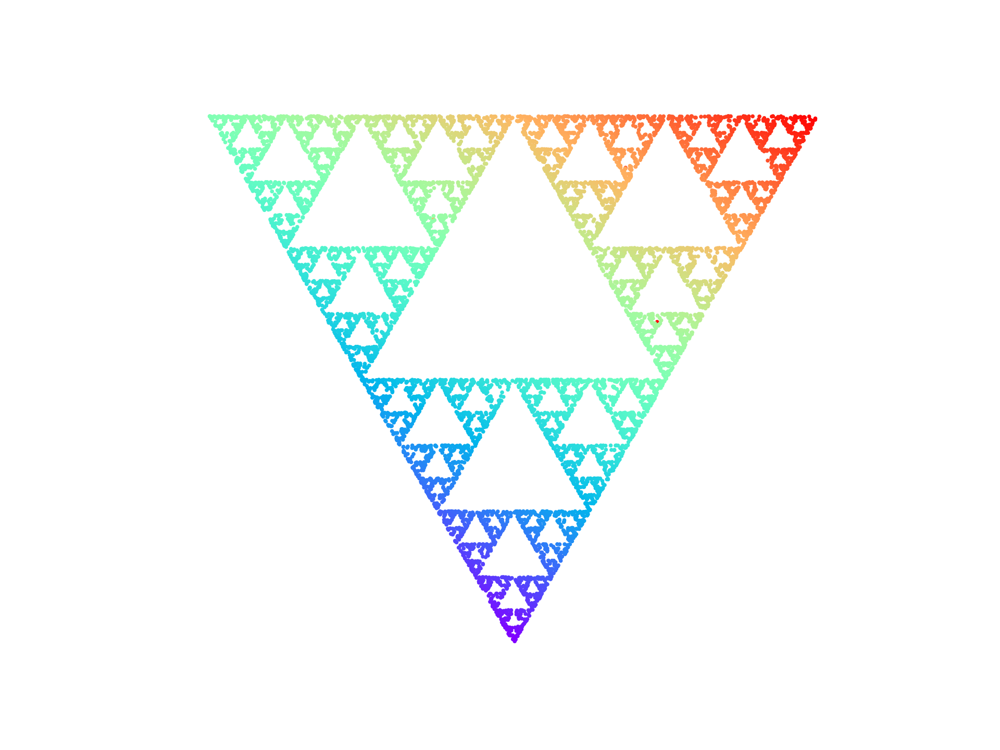
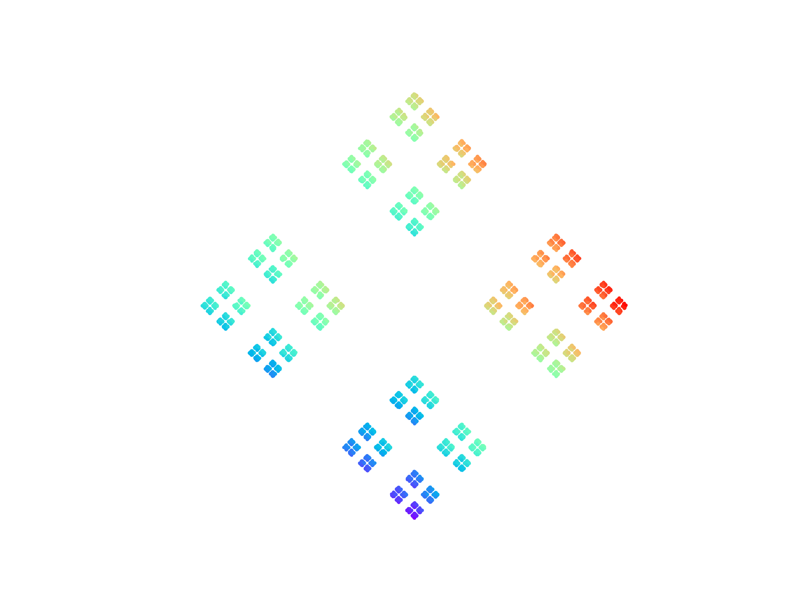
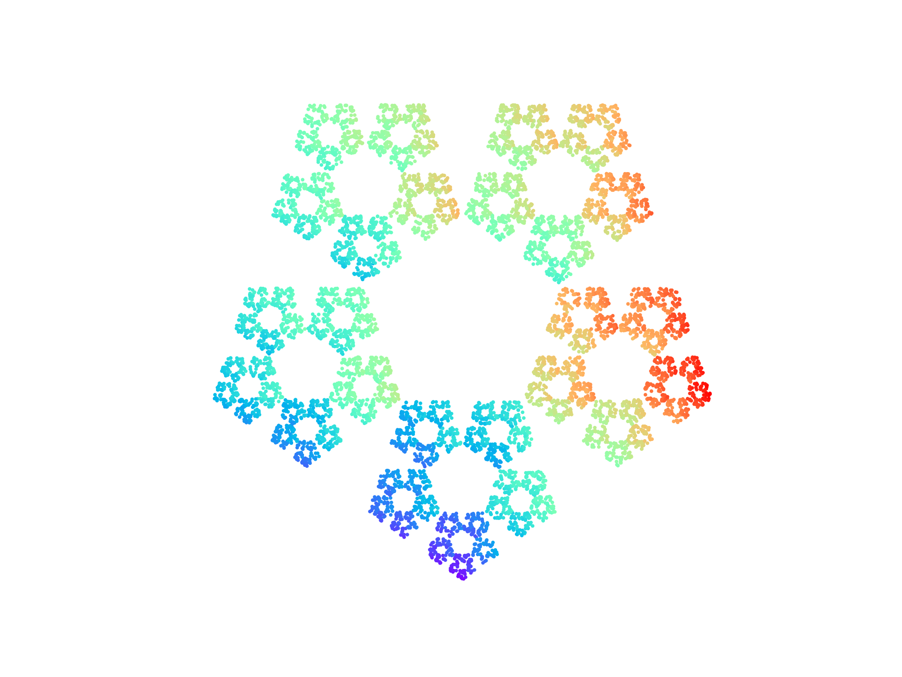
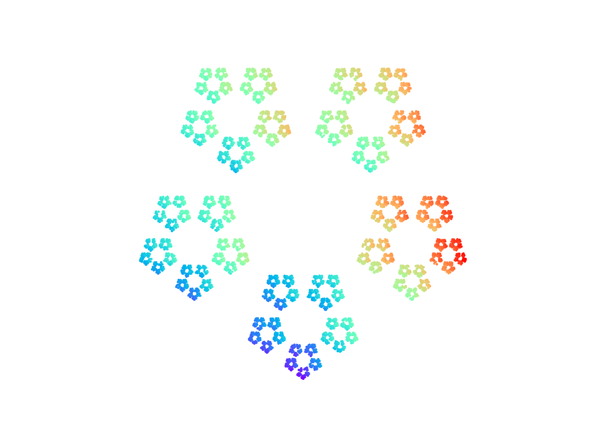
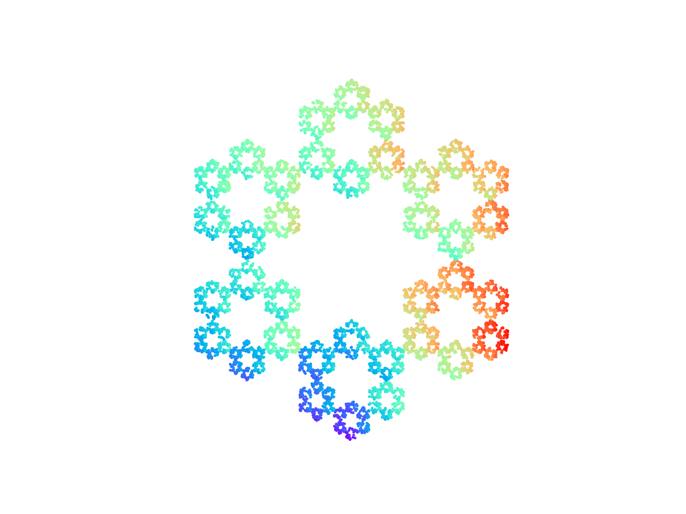

# H22_project3_anamji

    

## Author 
Ana Maria Jimenez Guiza - anamji (anamji@mail.uio.no)

### Comments
I did part 1 and 2, started in part 3 but is not finished. 

## Files in delivery
*triangle.py* 

 This file creates a Sierpiński Triangle 

*chaos_game.py*

 This file has a class that is able to create a regular polygon with any number of sides. It applies the same method as Sierpiński Triangle to the other polygons

    examples:

    
    
    
    
    

